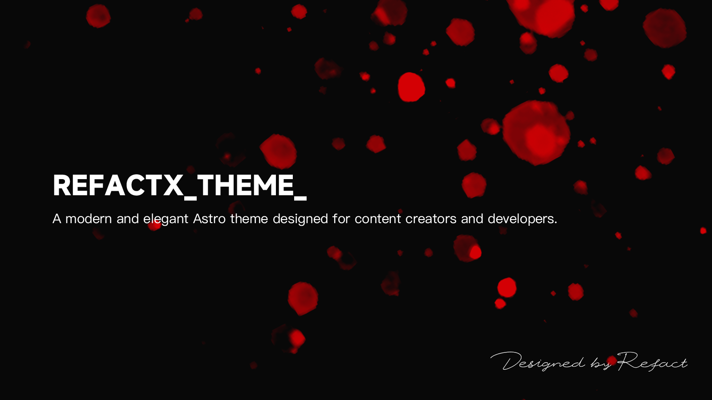

# RefactX 主题  

  

一款为内容创作者和开发者打造的现代、优雅的 Astro 主题。  

## 核心功能  

### 响应式设计  

- 流畅布局，无缝适配各种设备  
- 所有屏幕尺寸下均提供优化的阅读体验  

### 内容呈现  

- 多种文章布局（16:9、3:4、无图模式）  
- 支持动态图片缩放功能  
- 简洁的排版风格，支持自定义样式  

### 性能优化  

- 资源优化，实现快速页面加载  
- 内置图片优化功能  
- 极简 JavaScript 使用  

### 开发者体验  

- 提供 VS Code 代码片段，快速创建内容  
- 结构化的内容组织方式  
- 类型安全的内容集合  

### 内置功能  

- 基于标签的导航  
- 阅读时长预估  
- SEO 优化  
- 深色/浅色模式  
- 社交媒体预览支持  

### 内容专注体验  

- 无干扰的阅读环境  
- 多种内容布局可选  
- 代码语法高亮  
- 响应式图片画廊  

由 Refact 维护此副本，MIT许可证沿用原始版本
